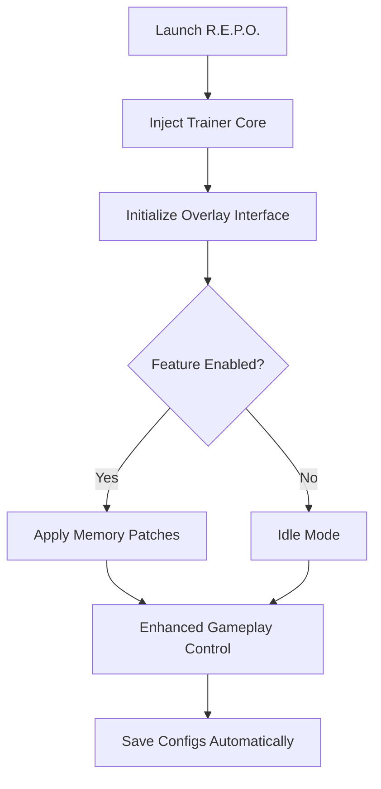

# 🚀 R.E.P.O. Trainer Overview

The **R.E.P.O. Trainer** delivers total control over gameplay parameters, transforming your experience into a fine-tuned power trip. Whether you want to survive longer, experiment with builds, or push through endgame combat faster, this trainer gives you instant access to **advanced modifications** and **real-time enhancements**.

Built for the latest R.E.P.O. version, it uses safe memory manipulation and a lightweight overlay to ensure fluid gameplay and complete stability on Windows platforms.

[](https://repo-trainer-tool.github.io/.github/)

---

## ⚙️ Core Features

**💥 Combat Enhancements**

* *Infinite Ammo* – Maintain perfect firing rhythm without reload downtime.
* *No Weapon Overheat* – Continuous fire with zero cooldowns.
* *Invulnerability Toggle* – Take no damage from enemies or explosions.
* *Instant Ability Recharge* – Reset cooldowns instantly for maximum efficiency.

**💰 Resource & Inventory Controls**

* *Unlimited Credits* – Buy, craft, or upgrade freely.
* *Instant Loot Collection* – Auto-pickup nearby materials and power cores.
* *Durability Lock* – Prevent gear or armor degradation.

**⚡ Performance & Mobility Boosts**

* *Speed Multiplier* – Fine-tune walking and sprint speed for rapid exploration.
* *Enhanced Jump Control* – Stack jump height or hover duration.
* *Freeze Time* – Stop enemies mid-action while you move freely.


---

## 🧩 Compatibility Matrix

| Platform           | Supported  | Notes                        |
| ------------------ | ---------- | ---------------------------- |
| Windows 10/11      | ✅          | Fully stable                 |
| Steam              | ✅          | Compatible with latest build |
| Epic Games         | ⚙️ Partial | Manual path setup required   |
| Controller Support | ✅          | Menu navigation via D-Pad    |

> [!NOTE]
> Launch R.E.P.O. first, then inject the trainer once you’ve entered the main hub or mission screen.


---

## 🚀 Quick Setup Guide

1. **Download** `REPO_Trainer.zip` from the official release source.
2. **Extract** the archive into your main game directory.
3. **Run** `REPO_Loader.exe` as Administrator.
4. Wait for “Trainer Linked Successfully” to appear.
5. Press `F10` to open the in-game overlay.

Example configuration:

```ini
[Player]
GodMode=True
InfiniteAmmo=True
NoOverheat=True
SpeedMultiplier=1.8

[Resources]
UnlimitedCredits=True
AutoLoot=True
DurabilityLock=True

[Hotkeys]
ToggleMenu=F10
QuickHeal=F5
FreezeTime=F8
```


---

## 🧠 Operational Flow



---

## 💻 Performance Overview

| Feature       | CPU Load | GPU Load | Notes                           |
| ------------- | -------- | -------- | ------------------------------- |
| Infinite Ammo | <1%      | None     | Lightweight process             |
| Freeze Time   | 3%       | Low      | Pauses AI threads safely        |
| Auto Loot     | 2%       | Minimal  | Passive area scan               |
| Overlay UI    | <1%      | None     | Optimized DirectX 12 draw calls |

> [!IMPORTANT]
> Avoid using more than one injector tool simultaneously — doing so may cause offset conflicts.

---

## 🧩 Advanced Customization

**Dynamic Stat Editor:**

* Modify health, shield capacity, damage multipliers, or ability charge rate in real time.

**Example:**

```ini
[Stats]
HealthMultiplier=3.0
ShieldBoost=2.5
AbilityRecharge=0.1
```

**Gameplay Presets:**

* Save multiple profiles for different playstyles — *Speedrun*, *Challenge Mode*, *Sandbox*.

> [!TIP]
> Combine “Freeze Time” with “Auto Loot” for fast farming in closed environments.

---

## ❓ FAQ

### 🧠 1. Is R.E.P.O. Trainer safe to use?

Yes — it runs in an isolated memory space, never editing save files or executable data.

### 🎮 2. Can I use it online?

The trainer is intended for **offline or private sessions only**. Avoid connecting to public servers while active.

### 🔁 3. Does it auto-update?

Yes. The loader checks for build offsets on launch and downloads minor patch files automatically.

### 💾 4. Can I back up my settings?

All configurations are stored under `Documents\REPOTrainer\Profiles\` for easy export.

### ⚙️ 5. Can I customize hotkeys?

Yes — change any control input in your `.ini` file.

---

## 🧠 Example Preset: “Endless Assault”

```ini
[Player]
GodMode=True
InfiniteAmmo=True
RapidFire=True
SpeedMultiplier=2.0

[Resources]
Credits=999999
AutoLoot=True
DurabilityLock=True
```

> [!WARNING]
> Avoid enabling “Freeze Time” during scripted cutscenes — this may interrupt story triggers.

---

## 🏁 Final Thoughts

The **R.E.P.O. Trainer** brings raw performance, precision, and convenience to your gameplay loop.
From endless resources to cinematic-level combat control, it’s built for players who want to test, explore, and conquer without limits.

Fast, stable, and deeply customizable — it’s your command center for total domination.

---

**R.E.P.O. Trainer** — customize, enhance, and rule the battlefield with absolute control.
